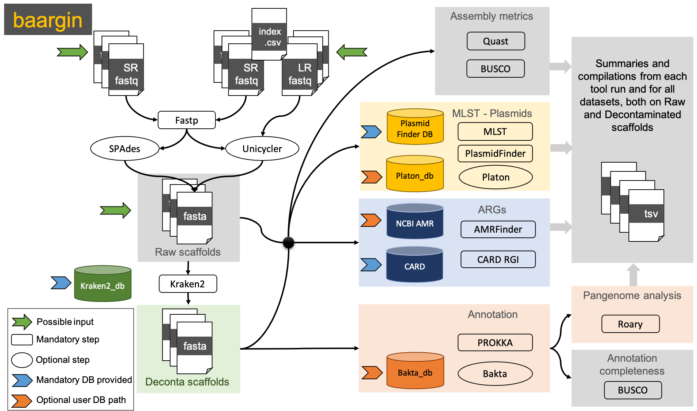

# baargin: Bacterial Assembly and Antimicrobial Resistance Genes detection In NextFlow
Workflow for analysis of Whole Genome Sequencing (WGS) data with AntiMicrobial Resistance (AMR) focus

 



## Table of Contents

   * [Prerequisites](#prerequisites)
   * [Installation](#installation)
      * [Using conda](#using-conda)
      * [Old school - Manually](#old-school---manually)
   * [Download databases](#download-databases)
     * [Mandatory databases](#mandatory-databases)
     * [Optional databases](#optional-databases)
   * [Usage and test](#usage)
   * [Parameters](#parameters)
   * [Uninstall](#uninstall)
   * [Complete help and options](#complete)
   * [Citation](#citation)
   * [Author](#author-and-contributors)


## Prerequisites

You need to have installed Docker or Singularity as the workflow uses containers to run the different tools.


## Installation

### Using conda

Prerequisite: conda

   <details>
      <summary>See here for conda installation</summary>

      Conda is installed by downloading and executing an installer from the Conda website, but which version you need depends on your operating system:

      ```
      # Install Miniconda3 for 64-bit Mac
      curl -L https://repo.continuum.io/miniconda/Miniconda3-4.7.12.1-MacOSX-x86_64.sh -O
      bash Miniconda3-4.7.12.1-MacOSX-x86_64.sh
      rm Miniconda3-4.7.12.1-MacOSX-x86_64.sh
      ```
      ```
      # Install Miniconda3 for 64-bit Linux
      curl -L https://repo.continuum.io/miniconda/Miniconda3-4.7.12.1-Linux-x86_64.sh -O
      bash Miniconda3-4.7.12.1-Linux-x86_64.sh
      rm Miniconda3-4.7.12.1-Linux-x86_64.sh
      ```
      The installer will ask you questions during the installation:

      Do you accept the license terms? (Yes)
      Do you accept the installation path or do you want to choose a different one? (Probably yes)
      Do you want to run conda init to setup Conda on your system? (Yes)
      Restart your shell so that the settings in ~/.bashrc/~/.bash_profile can take effect. You can verify that the installation worked by running:

      ```
      conda --version
      ```
      Lastly, we will setup the default channels (from where packages will be searched for and downloaded if no channel is specified).

      ```
      conda config --add channels defaults
      conda config --add channels bioconda
      conda config --add channels conda-forge
      ```
   </details>

Clone the baargin repository and move into it
```
git clone https://github.com/jhayer/baargin.git
cd baargin
```

Create an environment conda with needed dependencies:
```
conda env create -f conda_environment_baargin.yml
```

Activate the environment to be ready to use baargin:
```
conda activate baargin
```

### Old school - Manually

Python modules for the setup and installation of minimal databases.
Prerequisite: Python>=3.8.0  
```
pip install pyyaml gitpython requests biopython>=1.78 numpy>=1.22
```

Then, you need to install NextFlow version 22.04.0+ [https://www.nextflow.io](https://www.nextflow.io)

```
# verify Java version (at least version 8+)
java -version

# Setup nextflow (it will create a nextflow executable file in the current directory)
curl -s https://get.nextflow.io | bash

# Then clone the workflow repository
git clone https://github.com/jhayer/baargin.git
```
Then the repository folder appears in your local directory


## Download databases

### Mandatory databases

Go to the repository folder and run:
```
# download the mandatory databases to run the workflow
download_db.py
```

### Optional databases

Some databases are not mandatory can take a significant disk space. We do not provide a download script for those but they can be installed separately by the user who will then provide the path accordingly when running the workflow.

Please note that if path for these databases are not provided, the corresponding tool is not run by the workflow.

1. Platon database - for plasmids detection

Can take approx. 2.8G.
If you wish to download it, please visit:https://github.com/oschwengers/platon#database

The database can be downloaded without installing bakta. Just `curl` or `wget` the URL they provide.

2. Bakta database - for genome structural and functionnal annotation

Can take around 62 Gb.
If you wish to download it, please visit: [https://github.com/oschwengers/bakta](https://github.com/oschwengers/bakta#database)

If you do not want to install bakta for downloading its database, they provide a download link from Zenodo that you can directly `wget` or `curl` and then decompress. Example:

```
wget https://zenodo.org/record/7025248/files/db.tar.gz
tar -xzf db.tar.gz
```

If Bakta database is provided, the annotation will be performed by Bakta, otherwise Prokka will be used with its default database.


## Usage

You can first check the available options and parameters by running:
`nextflow run /path/to/baargin/main.nf -profile docker --help`

You always need to select a profile to run the workflow with.

We provide 3 profiles:
- `singularity`, a profile using Singularity to run the containers
- `docker`, a profile using Docker to run the containers
- `slurm`, to add if your system has a slurm executor (local by default)

We also provide `itrop` an example of config with a module environment, where some tools are run from modules installed on a HPC environment,
instead of containers.

Feel free to add your own favourite config, in the `conf` folder.

## Test the workflow

**On contigs**

You can test the workflow using already assembled contigs from 3 *E. coli* datasets. Contigs are located in the `data/contigs` directory of *baargin* repository.
You can run this, from the directory of your choice, as long as you give the path to the baargin directory (where the test `data` directory is located):

```
nextflow run /path/to/baargin/main.nf -profile docker \
  --contigs '/path/to/baargin/data/contigs'  \
  --genus 'Escherichia' --species 'coli' \
  --busco_lineage 'enterobacterales_odb10' --amrfinder_organism 'Escherichia' \
  --species_taxid '562' --output './results_test' -resume
```

**On short reads to test the assembly step**

We provide a test directory containing 3 illumina tests datasets, of *E. coli*, that have been downsampled to be lighter. 

```
nextflow run /path/to/baargin/main.nf -profile docker \
  --reads_folder '/path/to/baargin/data' --illumina_pattern "*_R{1,2}_001_subs10000.fastq.gz" \
  --genus 'Escherichia' --species 'coli' \
  --busco_lineage 'enterobacterales_odb10' --amrfinder_organism 'Escherichia' \
  --species_taxid '562' --output './results_test' -resume
```


# Parameters

## Mandatory

For running the workflow you need 3 mandatory parameters:
1. the input datasets: 3 possible inputs:
  - directory containing paired-end short reads (Illumina type): path to provide with the parameter `--reads_folder` 
  AND the parameter `--illumina_pattern`: pattern of the R1 and R2 illumina files paired. Ex: "*_{R1,R2}_001.fastq.gz" or "*_{1,2}.fastq.gz".
  If paired illumina data are provided, these 2 parameters are mandatory.

OR

  - directory containing already assembled contigs/scaffolds: path to provide with the parameter `--contigs`

OR
  - an index CSV file indicating path to short reads and long reads; for hybrid input requiring Unicycler hybrid assembly.
  The CSV index file is provided with the parameter `--hybrid_index ` and should look as below and must include the columns headers:

```
sampleID,read1,read2,ont
124,test_illu_hybrid/124_1.fq,test_illu_hybrid/124_2.fq,test_ont/barcode05_concat.fastq
365,test_illu_hybrid/365_1.fq,test_illu_hybrid/365_2.fq,test_ont/barcode01_concat.fastq
```

2. Three mandatory databases should already be in the `db` directory within the `baargin` directory (these paths are set by default in the `nextflow.config` after you have run the `download_db.py` script). 


Note: If you wish to set a different path for these 3 DB, you can overwrite in the command line using the parameters:
`--card_db path/to/card/db`
`--kraken2_db path/to/kraken/db`
`--plasmidfinder_db path/to/plasmidfinder/db`

3. A TaxID (NCBI Taxonomy ID) to which extract from to get "decontaminated" scaffolds/contigs belonging to the expected bacterial taxon. It can be a TaxID corresponding to an *order*, a *genus* or a *species*, and all the contigs classified by Kraken2 under this specified taxon and lower in the taxonomy (children taxa) will be retrieved as decontaminated.
This parameter is provided as follow:
`--species_taxid "562"` (in this example we want to extract seqeunces classified as Taxonomy_ID 562, which corresponds to *E. coli*


You set the output directory with `--output path/outputdir`, it is set by default to `./results` in the `nextflow.config` file.

You set the temporary directory with `--tmpdir path/tmpdir`, it is set by default to `./tmpdir` in the `nextflow.config` file.

You set the NextFlow work directory with `-work-dir path/work`, it is set by default to `./work` in the `nextflow.config` file.

## Optional parameters

**A. The databases**

You can set the paths to the optional databases (for amrfinder, bakta and platon) if you have them in local using the following parameters:

```
--amrfinder_db "/path/to/local/databases/amrfinder/latest"
--bakta_db "/path/to/local/databases/bakta_db"
--platon_db "/path/to/local/databases/platon/db"
```

*Note:* a database for amrfinder is included in its container.

If you want to avoid the download of Busco databases every time you run the pipeline, you can specify a local BUSCO database using:

`--busco_db_offline "/path/to/local/databases/busco_downloads"`

**B. The taxonomy parameters**

Additionally to the mandatory `--species_taxid` parameter, you can add the following parameters:

```
--genus = "Escherichia"
--species = "coli"
```

For BUSCO and AMRFinder, you can specify specific datasets to use.

```
--amrfinder_organism "Escherichia"
--busco_lineage "enterobacterales_odb10"
```

The values for these parameters can be found by typing:

`amrfinder --list_organisms` for AMRFinder (if you have it installed, or by running to corresponding container downloaded by *baargin*).
This is used for detecting the resistance mutations known for certain species.
Today (May 2023), the list of organisms available in AMRFinderPlus are:

```
Available --organism options: Acinetobacter_baumannii, Campylobacter, Enterococcus_faecalis, Enterococcus_faecium, 
Escherichia, Klebsiella, Neisseria, Pseudomonas_aeruginosa, Salmonella, Staphylococcus_aureus, 
Staphylococcus_pseudintermedius, Streptococcus_agalactiae, Streptococcus_pneumoniae, Streptococcus_pyogenes, Vibrio_cholerae
```

`busco --list-datasets` for BUSCO. If you don't know the lineage, you can always use the generic one bacteria by specifying:
`--busco_lineage "bacteria_odb10"`.

A container directory is ususally created in the `work-dir` specified, if you have not specified another path to Nextflow for the containers. You can find the containers for all the tools used by baaring in that directory.

**C. Phred type**

If your reads fastq files are coded with a Phred score 64 (like some files coming from BGI), instead of the current and usual 33, you can specify it using the option:
`--phred_type 64` (default is 33)


## Setting the parameters in a config file 

You can avoid writing all the parameters by providing a config file containing the parameters (e.g. paths to databases, busco lineage...)
here is an example config:

```
// Workflow parameters
params.output = "./results"
params.tmpdir = "./tmpdir"

// Nextflow configuration options
workDir = './work'
resume = true

//db
// Full Kraken nt database instead of the mini standard 4Gb
params.kraken2_db = "/path/to/local/databases/kraken2/22-09/nt/"

params.amrfinder_db = "/path/to/local/databases/amrfinder/latest"
params.bakta_db = "/path/to/local/databases/bakta_db_2208/db/"
params.busco_db_offline = "/path/to/local/databases/busco_downloads"
params.platon_db = "/path/to/local/databases/platon/db"

// Species options
params.amrfinder_organism = "Escherichia"
params.busco_lineage = "enterobacterales_odb10"
params.genus = "Escherichia"
params.species = "coli"
params.species_taxid = "562"

// these are the options for my local HPC using Slurm
process {
    clusterOptions = '-p highmemplus --nodelist=node5'
    // You can also override existing process cpu or time settings here too.
}
```

If you have such a file, you can run the workflow providing the config file with `-c path/to/my_config`. Like this:

```
nextflow run baargin/main.nf -profile singularity,slurm \
  -c 'path_to_my_params/params_node5_slurm.config' \
  --reads_folder 'path/to/your/illumina/reads_folder' \
  --illumina_pattern "*_{R1,R2}_001.fastq.gz" \
  --output 'results_Ecoli'
```


## Complete help and options

````
********* Workflow for bacterial genome assembly and detection of antimicrobial resistances and plasmids *********

    Usage example:
nextflow run main.nf --reads_folder data --illumina_pattern "*R{1,2}_001_subs10000.fastq.gz" --genus Escherichia --species coli --species_taxid 562 -profile docker -resume
--help                      prints the help section

    Input sequences:
--illumina_pattern          pattern of the R1 and R2 illumina files paired. Ex: "*_{R1,R2}_001.fastq.gz" or "*_{1,2}.fastq.gz". Required with --reads_folder and must be quoted (default: null)
--reads_folder              path to the directory containing the illumina reads files (fastq.gz) (default: null)
OR
--contigs                   path to the directory containing the already assembled contigs files (fasta) (default: null)
OR
--hybrid_index              For users having both short and long reads:
                            path to the CSV file containing the mapping between sampleID, illuminaR1.fastq.gz, illuminaR2.fastq.gz, ont_read.fastq
                            Must have the header as follow:
                            sampleID,read1,read2,ont

                            Example of CSV index file:
                            sampleID,read1,read2,ont
                            124,test_illu_hybrid/124_1.fq,test_illu_hybrid/124_2.fq,test_ont/barcode05_concat.fastq
                            365,test_illu_hybrid/365_1.fq,test_illu_hybrid/365_2.fq,test_ont/barcode01_concat.fastq

    Output:
--output                    path to the output directory (default: ./results)
--tmpdir                    path to the tmp directory (default: ./tmpdir)

    Species mandatory options:
--genus                     Bacterial genus (Escherichia, Salmonella, Enterobacter, Klebsiella, Staphylococcus)  [default: null]
--species                   bacterial species to assemble (e.g. coli, pneumoniae, cloacae, aureus) [default: null]
--species_taxid             NCBI TaxID of the bacterial species to assemble [default: null]

    Databases path required (script provided for downloading them):
--card_db                   path to the CARD json Database for Antimicrobial Resistance Genes prediction [default: ]
--kraken2_db                path to the local Kraken2 nucleotide database (e.g. MiniKraken, nt, standard) [default: ]
--plasmidfinder_db          path to the CGE PlasmidFinder database [default: ]

    Optional databases paths: if provided, the tool is run:
--amrfinder_db              path to a local AMRFinder Database for Antimicrobial Resistance Genes prediction [default: ] - a database is provided within the container

--bakta_db                  path to the Bakta local database if the user prefers annotating the genomes with Bakta instead of Prokka [default: ]
--busco_db_offline          path to local BUSCO datasets if user wants to run BUSCO offline [default: null]
--platon_db                 path to the Platon local database

   Optional input:
--phred_type                phred score type. Specify if 33 (default and current) or 64 (ex. BGI, older...) [default: 33]
--busco_lineage             to specify according to the bacterial species. e.g. enterobacterales_odb10, bacillales_odb10... check BUSCO [default: null]
                            If not provided, Busco will use prokaryotes database
--amrfinder_organism        To specify for PointMutation detection
                            Can be among these: Acinetobacter_baumannii, Campylobacter,
                            Clostridioides_difficile, Enterococcus_faecalis, Enterococcus_faecium,
                            Escherichia, Klebsiella, Neisseria, Pseudomonas_aeruginosa,
                            Salmonella, Staphylococcus_aureus, Staphylococcus_pseudintermedius,
                            Streptococcus_agalactiae, Streptococcus_pneumoniae, Streptococcus_pyogenes, Vibrio_cholerae.
                            The amrfinderplus will be run if not specified, but no point mutations are detected.
                            [default: null]
                            If not provided, resistance genes will be detected but not species-specific point mutations involved in AMR
    Nextflow options:
-profile                    change the profile of nextflow both the engine and executor more details on github README
-resume                     resume the workflow where it stopped

        Outputed directories:
sample_ID
  AMR                       The output directory for resistance genes analysis: ARMFinderPlus and CARD
  annotation                The annotation directory containing Prokka or Bakta output if run
  assembly                  The spades assembly output directory with scaffolds.fasta files and all metrics related to assembly (busco, quast) and the "decontaminated" scaffolds
    |
     --taxonomic_classif    The taxonomic classification from Kraken2 at contigs/scaffolds level - the extracted scaffolds using provided TaxID are in the (upper) assembly directory
  plasmids                  The output directory for plasmids identification with PlasmidFinder and Platon
  qc                        The reads file after qc, qc logs and host mapping logs

compile_results             The ouput directory for the summary files of all samples together, from all tools used. Presence/Absence (1/0) tabular (tsv) files
pangenome                   The pangenome analysis output directory from Roary
````

## Uninstall

You can simply remove the `baargin` directory from your computer, and remove the
conda environment:
```
conda remove -n baargin
```

## Citation

## Author and contributors

Juliette Hayer  (@jhayer)
Jacques Dainat  (@Juke34)
