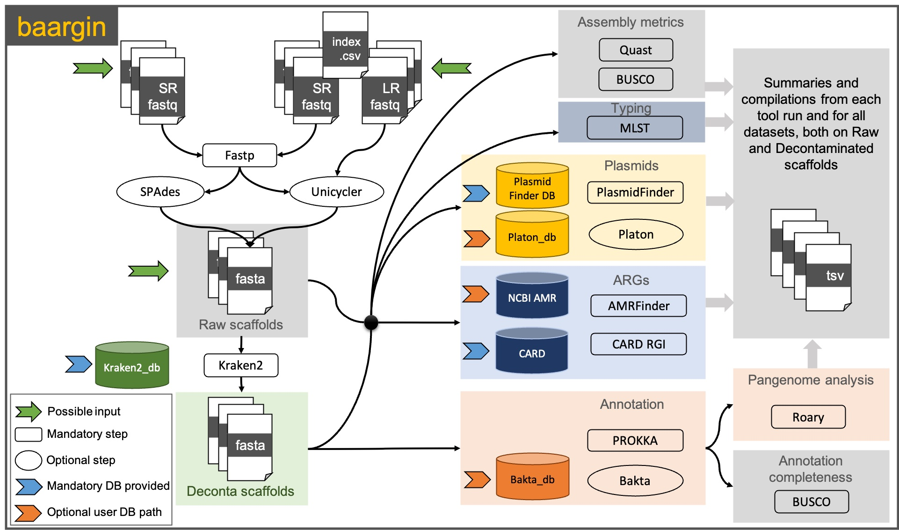

[](https://doi.org/10.21105/joss.05397)

baargin: Bacterial Assembly and Antimicrobial Resistance Genes detection In NextFlow 
=========================================  
 
Workflow for analysis of Whole Genome Sequencing (WGS) data with AntiMicrobial Resistance (AMR) focus
  
  
## Table of Contents

   * [Foreword](#foreword)
   * [Installation](#installation)
      * [Baargin](#baargin)
      * [Nextflow](#nextflow)
      * [Container platform](#container-platform)
        * [Docker](#docker)
        * [Singularity](#singularity)  
      * [Databases](#databases)
        * [Mandatory databases](#mandatory-databases)
        * [Optional databases](#optional-databases)
   * [Usage and test](#usage)
   * [Parameters](#parameters)
   * [Uninstall](#uninstall)
   * [Complete help and options](#complete-help-and-options)
   * [Citation](#citation)
   * [Author](#author-and-contributors)

## Foreword

The *baargin* workflow allows to perform a complete *in silico* analysis of bacterial genomics datasets from multiple isolates in parallel.
The user can input sequencing datasets from short reads only or from both short and long reads (hybrid assembly Illumina + Oxford Nanopore Technologies), of several bacterial strains from the same species in one command line. The workflow will automatically assemble the genomes, assign the taxonomy of the assembled sequences (contigs) and specifically extract the sequences that belong the expected taxon (specified by the user). The contigs extracted at that step are then called *deconta* (for decontaminated).
For both *raw* and *deconta* contigs, *baargin* will then:
-	identify their sequence type (MLST),
-	screen for plasmids sequences,
-	detect Antimicrobial Resistance Genes (ARGs) and mutations, and 
-	perform genome annotation (*deconta* only). 

The workflow compiles and summarizes the results from all the analysis steps, allowing comparative studies. As a last step, *baargin* performs a pangenome analysis of all the genomics datasets provided, producing the basis for the construction of a phylogenetic tree. 
A flowchart below describes the process.





## Installation

The prerequisites to run the pipeline are:  

  * The baargin repository
  * [Nextflow](https://www.nextflow.io/)  >= 22.04.0
  * [Docker](https://www.docker.com) or [Singularity](https://sylabs.io/singularity/)  
  * Databases

### Baargin

```bash
# clone the workflow repository
git clone https://github.com/jhayer/baargin.git

# Move in it
cd baargin
```

### Nextflow 

  * Via conda 

    <details>
      <summary>See here</summary>
      This will install Nextflow as well dependencies for convenient scripts to download the DBs.  

      Clone the baargin repository and move into it
      ```
      git clone https://github.com/jhayer/baargin.git
      cd baargin
      ```

      Create an environment conda with needed dependencies:
      ```
      conda env create -f conda_environment_baargin.yml
      ```

      Activate the environment to be ready to use baargin:
      ```
      conda activate baargin
      ```  
    </details>

  * Manually
    <details>
      <summary>See here</summary>
       Nextflow runs on most POSIX systems (Linux, macOS, etc) and can typically be installed by running these commands:

      ```
      # Make sure 11 or later is installed on your computer by using the command:
      java -version

      # Install Nextflow by entering this command in your terminal(it creates a file nextflow in the current dir):
      curl -s https://get.nextflow.io | bash 

      # Add Nextflow binary to your user's PATH:
      mv nextflow ~/bin/
      # OR system-wide installation:
      # sudo mv nextflow /usr/local/bin
      ```
    </details>

### Container platform

To run the workflow you will need a container platform: docker or singularity.

### Docker

Please follow the instructions at the [Docker website](https://docs.docker.com/desktop/)

### Singularity

Please follow the instructions at the [Singularity website](https://docs.sylabs.io/guides/latest/admin-guide/installation.html)

### Databases

#### Via download_db.py 

  * Prerequisites
    The use of the script `download_db.py` requires python and python modules.

      * Via conda

        <details>
            <summary>See here</summary>
            This will actually install Nextflow as well dependencies for convenient scripts to download the DBs.  

            Clone the baargin repository and move into it
            ```
            git clone https://github.com/jhayer/baargin.git
            cd baargin
            ```

            Create an environment conda with needed dependencies:
            ```
            conda env create -f conda_environment_baargin.yml
            ```

            Activate the environment to be ready to use baargin:
            ```
            conda activate baargin
            ```
        </details>

      * Manually

        <details>
          <summary>See here</summary>

            Prerequisite: Python>=3.8.0  
            ```
            pip install pyyaml gitpython requests 'biopython>=1.78' 'numpy>=1.22'
            ```
        </details>
  
  * Usage

    Go to the repository folder and run:
    ```
    ./download_db.py
    ```

    This will download the Mandatory databases. For better results you may whish to install optional databases. See [Optional databases](#optional-databases). You can also diwload optional databases via `download_db.py` by uncommenting appropriate lines in the `db.yaml` files.


#### Manually

Create a dedicated folder where you will put all the databases. 

```bash
    mkdir db
    cd db
 ```

You will have to provide baargin with each database path. 
(By strictly following the folder structure described here, you may skip to provide the mandatory databases paths in baargin command line)

##### Mandatory databases

  * Plasmid finder  
    ```bash
    git clone https://bitbucket.org/genomicepidemiology/plasmidfinder_db
    mv plasmidfinder_db plasmidfinder
    ```

  * Card  
    ```bash
    # Via wget
    wget https://card.mcmaster.ca/download/0/broadstreet-v3.2.6.tar.bz2
    # or via curl
    curl https://card.mcmaster.ca/download/0/broadstreet-v3.2.6.tar.bz2 --output broadstreet-v3.2.6.tar.bz2

    # The uncompress it in a dedicated folder
    mkdir card
    tar -xf broadstreet-v3.2.6.tar.bz2 -C card
    ```

  * kraken2_mini  
      ```bash
    # Via wget
    wget https://zenodo.org/record/7648745/files/kraken2_mini_standard_db_202302.tar.gz
    # or via curl
    curl https://zenodo.org/record/7648745/files/kraken2_mini_standard_db_202302.tar.gz --output kraken2_mini_standard_db_202302.tar.gz

    # The uncompress it in a dedicated folder
    mkdir kraken2_mini
    tar -xf broadstreet-v3.2.6.tar.bz2 -C kraken2_mini
    ``` 

##### Optional databases

Some databases are not mandatory can take a significant disk space. We do not provide a download script for those but they can be installed separately by the user who will then provide the path accordingly when running the workflow.

Please note that if path for these databases are not provided, the corresponding tool is not run by the workflow.

1. Platon database - for plasmids detection

Can take approx. 2.8G.
If you wish to download it, please visit:https://github.com/oschwengers/platon#database

The database can be downloaded without installing bakta. Just `curl` or `wget` the URL they provide.

2. Bakta database - for genome structural and functionnal annotation

Can take around 62 Gb.
If you wish to download it, please visit: [https://github.com/oschwengers/bakta](https://github.com/oschwengers/bakta#database)

If you do not want to install bakta for downloading its database, they provide a download link from Zenodo that you can directly `wget` or `curl` and then decompress. Example:

```
wget https://zenodo.org/record/7025248/files/db.tar.gz
tar -xzf db.tar.gz
```

If Bakta database is provided, the annotation will be performed by Bakta, otherwise Prokka will be used with its default database.


## Usage

You can first check the available options and parameters by running:
`nextflow run main.nf --help`

To run the workflow you must select a profile according to the container platform you want to use:   
- `singularity`, a profile using Singularity to run the containers
- `docker`, a profile using Docker to run the containers

The command will look like that: 
```
nextflow run main.nf -profile docker <rest of paramaters>
```

We provide 2 other profiles:

- `slurm`, to add if your system has a slurm executor (local by default)
- `itrop`, which is an example of config with a module environment, where some tools are run from modules installed on a HPC environment, instead of containers.

The use of e.g. `slurm` profile  will give a command like this one: 
```
nextflow run main.nf -profile docker,slurm <rest of paramaters>
```

Feel free to add your own favourite config, in the `conf` folder.

## Test the workflow

**On contigs - test profile**

You can test the workflow using already assembled contigs from 3 *E. coli* datasets. Contigs are located in the `test/input/contigs` directory of *baargin* repository.
You can run this from the *baargin* directory:

```
nextflow run main.nf -profile docker,test
```
You may replace docker by singularity depending on your system.
The above command with the `test` profile actually runs this one:

```
nextflow run main.nf -profile docker \
  --contigs 'test/input/contigs'  \
  --genus 'Escherichia' --species 'coli' --species_taxid 562 \
  --busco_lineage 'enterobacterales_odb10' \
  --output './results_test' -resume
```

On success you should get a message looking like this:
```
Completed at: 28-Aug-2023 12:17:26
Duration    : 12m 36s
CPU hours   : 1.7
Succeeded   : 54
```

This results are from a run on 8 cpus but it can take up to 1 hour and 30 minutes using a single cpu.

Your output folder `results_test` and its sufolders and files should look the same as what is in the directory `test/output/`
containing all the outputs of a successful test run.


**Optional: on short reads to test the assembly step**

We provide a test directory containing 3 illumina tests datasets, of *E. coli*, that have been downsampled to be lighter.

```
nextflow run main.nf -profile docker \
  --reads_folder 'test/input/' --illumina_pattern "*_R{1,2}_001_subs10000.fastq.gz" \
  --genus 'Escherichia' --species 'coli' --species_taxid '562' \
  --busco_lineage 'enterobacterales_odb10' --amrfinder_organism 'Escherichia' \
  --output './results_test' -resume
```


# Parameters

## Mandatory

For running the workflow you need 3 mandatory parameters:
1. the input datasets: 3 possible inputs:
  - directory containing paired-end short reads (Illumina type): path to provide with the parameter `--reads_folder`
  AND the parameter `--illumina_pattern`: pattern of the R1 and R2 illumina files paired. Ex: "*_{R1,R2}_001.fastq.gz" or "*_{1,2}.fastq.gz".
  If paired illumina data are provided, these 2 parameters are mandatory.

OR

  - directory containing already assembled contigs/scaffolds: path to provide with the parameter `--contigs`

OR
  - an index CSV file indicating path to short reads and long reads; for hybrid input requiring Unicycler hybrid assembly.
  The CSV index file is provided with the parameter `--hybrid_index ` and should look as below and must include the columns headers:

```
sampleID,read1,read2,ont
124,test_illu_hybrid/124_1.fq,test_illu_hybrid/124_2.fq,test_ont/barcode05_concat.fastq
365,test_illu_hybrid/365_1.fq,test_illu_hybrid/365_2.fq,test_ont/barcode01_concat.fastq
```

2. Three mandatory databases should already be in the `db` directory within the `baargin` directory (these paths are set by default in the `nextflow.config` after you have run the `download_db.py` script).


Note: If you wish to set a different path for these 3 DB, you can overwrite in the command line using the parameters:
`--card_db path/to/card/db`
`--kraken2_db path/to/kraken/db`
`--plasmidfinder_db path/to/plasmidfinder/db`

3. A TaxID (NCBI Taxonomy ID) to which extract from to get "decontaminated" scaffolds/contigs belonging to the expected bacterial taxon. It can be a TaxID corresponding to an *order*, a *genus* or a *species*, and all the contigs classified by Kraken2 under this specified taxon and lower in the taxonomy (children taxa) will be retrieved as decontaminated.
This parameter is provided as follow:
`--species_taxid "562"` (in this example we want to extract seqeunces classified as Taxonomy_ID 562, which corresponds to *E. coli*


You set the output directory with `--output path/outputdir`, it is set by default to `./results` in the `nextflow.config` file.

You set the temporary directory with `--tmpdir path/tmpdir`, it is set by default to `./tmpdir` in the `nextflow.config` file.

You set the NextFlow work directory with `-work-dir path/work`, it is set by default to `./work` in the `nextflow.config` file.

## Optional parameters

**A. The databases**

You can set the paths to the optional databases (for amrfinder, bakta and platon) if you have them in local using the following parameters:

```
--amrfinder_db "/path/to/local/databases/amrfinder/latest"
--bakta_db "/path/to/local/databases/bakta_db"
--platon_db "/path/to/local/databases/platon/db"
```

*Note:* a database for AMRFinder is included in its container, so this option `--amrfinder_db` is to be set only if you want Baargin to use your local database.

If you want to avoid the download of Busco databases every time you run the pipeline, you can specify a local BUSCO database using:

`--busco_db_offline "/path/to/local/databases/busco_downloads"`

**B. The taxonomy parameters**

Additionally to the mandatory `--species_taxid` parameter, you can add the following parameters and those will be used for the annotation:

```
--genus = "Escherichia"
--species = "coli"
```

For BUSCO and AMRFinder, you can specify specific datasets to use.

```
--amrfinder_organism "Escherichia"
--busco_lineage "enterobacterales_odb10"
```

The values for these parameters can be found by typing:

`amrfinder --list_organisms` for AMRFinder (if you have it installed, or by running to corresponding container downloaded by *baargin*).
This is used for detecting the resistance mutations known for certain species.
Today (May 2023), the list of organisms available in AMRFinderPlus are:

```
Available --organism options: Acinetobacter_baumannii, Campylobacter, Enterococcus_faecalis, Enterococcus_faecium,
Escherichia, Klebsiella, Neisseria, Pseudomonas_aeruginosa, Salmonella, Staphylococcus_aureus,
Staphylococcus_pseudintermedius, Streptococcus_agalactiae, Streptococcus_pneumoniae, Streptococcus_pyogenes, Vibrio_cholerae
```

`busco --list-datasets` for BUSCO. If you don't know the lineage, you can always use the generic one bacteria by specifying:
`--busco_lineage "bacteria_odb10"`.

A container directory is ususally created in the `work-dir` specified, if you have not specified another path to Nextflow for the containers. You can find the containers for all the tools used by baaring in that directory.

**C. Phred type**

If your reads fastq files are coded with a Phred score 64 (like some files coming from BGI), instead of the current and usual 33, you can specify it using the option:
`--phred_type 64` (default is 33)


## Setting the parameters in a config file

You can avoid writing all the parameters by providing a config file containing the parameters (e.g. paths to databases, busco lineage...)
here is an example config:

```
// Workflow parameters
params.output = "./results"
params.tmpdir = "./tmpdir"

// Nextflow configuration options
workDir = './work'
resume = true

//db
// Full Kraken nt database instead of the mini standard 4Gb
params.kraken2_db = "/path/to/local/databases/kraken2/22-09/nt/"

params.amrfinder_db = "/path/to/local/databases/amrfinder/latest"
params.bakta_db = "/path/to/local/databases/bakta_db_2208/db/"
params.busco_db_offline = "/path/to/local/databases/busco_downloads"
params.platon_db = "/path/to/local/databases/platon/db"

// Species options
params.amrfinder_organism = "Escherichia"
params.busco_lineage = "enterobacterales_odb10"
params.genus = "Escherichia"
params.species = "coli"
params.species_taxid = "562"

// these are the options for my local HPC using Slurm
process {
    clusterOptions = '-p highmemplus --nodelist=node5'
    // You can also override existing process cpu or time settings here too.
}
```

If you have such a file, you can run the workflow providing the config file with `-c path/to/my_config`. Like this:

```
nextflow run baargin/main.nf -profile singularity,slurm \
  -c 'path_to_my_params/params_node5_slurm.config' \
  --reads_folder 'path/to/your/illumina/reads_folder' \
  --illumina_pattern "*_{R1,R2}_001.fastq.gz" \
  --output 'results_Ecoli'
```


## Complete help and options

````
********* Workflow for bacterial genome assembly and detection of antimicrobial resistances and plasmids *********

    Usage example:
nextflow run main.nf --reads_folder data --illumina_pattern "*R{1,2}_001_subs10000.fastq.gz" --genus Escherichia --species coli --species_taxid 562 -profile docker -resume
--help                      prints the help section

    Input sequences:
--illumina_pattern          pattern of the R1 and R2 illumina files paired. Ex: "*_{R1,R2}_001.fastq.gz" or "*_{1,2}.fastq.gz". Required with --reads_folder and must be quoted (default: null)
--reads_folder              path to the directory containing the illumina reads files (fastq.gz) (default: null)
OR
--contigs                   path to the directory containing the already assembled contigs files (fasta) (default: null)
OR
--hybrid_index              For users having both short and long reads:
                            path to the CSV file containing the mapping between sampleID, illuminaR1.fastq.gz, illuminaR2.fastq.gz, ont_read.fastq
                            Must have the header as follow:
                            sampleID,read1,read2,ont

                            Example of CSV index file:
                            sampleID,read1,read2,ont
                            124,test_illu_hybrid/124_1.fq,test_illu_hybrid/124_2.fq,test_ont/barcode05_concat.fastq
                            365,test_illu_hybrid/365_1.fq,test_illu_hybrid/365_2.fq,test_ont/barcode01_concat.fastq

    Output:
--output                    path to the output directory (default: ./results)
--tmpdir                    path to the tmp directory (default: ./tmpdir)

    Species mandatory options:
--genus                     Bacterial genus (Escherichia, Salmonella, Enterobacter, Klebsiella, Staphylococcus)  [default: null]
--species                   bacterial species to assemble (e.g. coli, pneumoniae, cloacae, aureus) [default: null]
--species_taxid             NCBI TaxID of the bacterial species to assemble [default: null]

    Databases path required (script provided for downloading them):
--card_db                   path to the CARD json Database for Antimicrobial Resistance Genes prediction [default: ]
--kraken2_db                path to the local Kraken2 nucleotide database (e.g. MiniKraken, nt, standard) [default: ]
--plasmidfinder_db          path to the CGE PlasmidFinder database [default: ]

    Optional databases paths: if provided, the tool is run:
--amrfinder_db              path to a local AMRFinder Database for Antimicrobial Resistance Genes prediction [default: ] - a database is provided within the container

--bakta_db                  path to the Bakta local database if the user prefers annotating the genomes with Bakta instead of Prokka [default: ]
--busco_db_offline          path to local BUSCO datasets if user wants to run BUSCO offline [default: null]
--platon_db                 path to the Platon local database

   Optional input:
--phred_type                phred score type. Specify if 33 (default and current) or 64 (ex. BGI, older...) [default: 33]
--busco_lineage             to specify according to the bacterial species. e.g. enterobacterales_odb10, bacillales_odb10... check BUSCO [default: null]
                            If not provided, Busco will use prokaryotes database
--amrfinder_organism        To specify for PointMutation detection
                            Can be among these: Acinetobacter_baumannii, Campylobacter,
                            Clostridioides_difficile, Enterococcus_faecalis, Enterococcus_faecium,
                            Escherichia, Klebsiella, Neisseria, Pseudomonas_aeruginosa,
                            Salmonella, Staphylococcus_aureus, Staphylococcus_pseudintermedius,
                            Streptococcus_agalactiae, Streptococcus_pneumoniae, Streptococcus_pyogenes, Vibrio_cholerae.
                            The amrfinderplus will be run if not specified, but no point mutations are detected.
                            [default: null]
                            If not provided, resistance genes will be detected but not species-specific point mutations involved in AMR
    Nextflow options:
-profile                    change the profile of nextflow both the engine and executor more details on github README
-resume                     resume the workflow where it stopped

        Outputed directories:
sample_ID
  AMR                       The output directory for resistance genes analysis: ARMFinderPlus and CARD
  annotation                The annotation directory containing Prokka or Bakta output if run
  assembly                  The spades assembly output directory with scaffolds.fasta files and all metrics related to assembly (busco, quast) and the "decontaminated" scaffolds
    |
     --taxonomic_classif    The taxonomic classification from Kraken2 at contigs/scaffolds level - the extracted scaffolds using provided TaxID are in the (upper) assembly directory
  plasmids                  The output directory for plasmids identification with PlasmidFinder and Platon
  qc                        The reads file after qc, qc logs and host mapping logs

compile_results             The ouput directory for the summary files of all samples together, from all tools used. Presence/Absence (1/0) tabular (tsv) files
pangenome                   The pangenome analysis output directory from Roary
````

## Uninstall

You can simply remove the `baargin` directory from your computer, and remove the
conda environment:
```
conda remove -n baargin
```


## Contributing

We welcome contributions from the community! See our [Contributing guidelines](https://github.com/jhayer/baargin/blob/main/CONTRIBUTING.md)

## Report bugs and issues

Found a bug or have a question? Please open an [issue](https://github.com/jhayer/baargin/issues).
Precisions on how to report issues are given in our [Contributing guidelines](https://github.com/jhayer/baargin/blob/main/CONTRIBUTING.md)


## Citation

Hayer J., Dainat J., Marcy E. and Bañuls A. L., (2023). Baargin: a Nextflow workflow for the automatic analysis of bacterial genomics data with a focus on Antimicrobial Resistance. Journal of Open Source Software, 8(90), 5397, https://doi.org/10.21105/joss.05397

[](https://doi.org/10.21105/joss.05397)

## Author and contributors

Juliette Hayer  (@jhayer)  
Jacques Dainat  (@Juke34)
