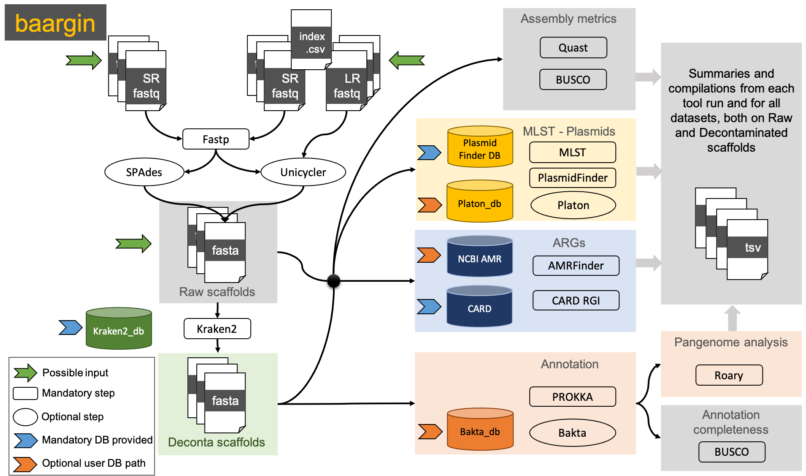

# Summary

The emergence and development of Antimicrobial Resistance (AMR) is a global health
problem, that could cause about 10 million deaths yearly by 2050 [@Thompson:2022].
The study of the genomes of these (multi)resistant bacterial strains is of high
importance to understand emergence and circulation of the resistance. In the past
couple of decades, high throughput sequencing technologies have seriously improved
and it is now affordable to sequence the full genomes of hundreds of bacterial
at a time. As a counterpart, these experiments produce large amount of data that
needs to be analysed by various bioinformatics methods and tools for reconstructing
the genomes and therefore identify their specific features and the genetic
determinants of the AMR. For automating the bioinformatics analysis of multiple
strains, we have developed a NextFlow [@DITommaso:2017] workflow: *baargin* [https://github.com/jhayer/baargin](https://github.com/jhayer/baargin).
It enables to conduct sequencing reads quality control, genome assembly and annotation,
Multi-Locus Sequence Typing and plasmid identification, as well as antimicrobial
resistance determinants detection, and pangenome analysis. The use of NextFlow,
a workflow management system, makes our workflow portable, flexible, and able to
conduct reproducible analyses.

# Statement of need

The DNA Hight Throughput Sequencing technologies produce a significant amount of data,
and the DNA from multiple bacterial strains can be sequenced at the same time on a same
sequencing run. Moreover, researchers are producing genomics data all over the world on a
daily basis, notably to better understand the spread of bacterial pathogens and
their resistance to antibiotics. The analyse this data requires the use of a
wide range of bioinformatics programs to be able to identify the genomic structure,
the genes and their functions, and among those, the genes and mutations conferring
resistance to antimicrobial drugs. In order to make the results of these analyses
comparable, it is crucial to standardize, automate and parallelize all the steps to ensure the
reproducibility of the data analysis. The workflow that we have developed allows
the user to perform a complete *in silico* analysis of a bacterial genome, from
the quality control of the raw data, to the detection of AMR genes and mutations,
on multiple datasets of bacterial strains of the same species in parallel.
It compiles and summarize the results from all the analysis steps, allowing comparative
studies, and it also performs a pangenome analysis of all the strains provided,
providing the basis for the construction of a phylogenetic tree.

# Materials and Methods

## Features

Baargin is designed to automatically parallelize workflow steps. It does not require
manual intervention from the users between steps. Each workflow step, called process,
uses containers, via Docker or Singularity, which also greatly improves
traceability and reproducibility. Additional processes can be easily added in the future
as the workflow is designed in modules, making it flexible for adding or removing steps.

## Workflow

\autoref{fig:Figure1} describes the workflow:

1. Input can be either a folder containing paired-end short reads (fastq format),
a folder containing already assembled contigs (fasta format files), or an index
file containing the paths to pair-end short reads (fastq files) and to long reads
(ONT, fastq file) for the same sample/strain in order to perform hybrid assembly.
If assembled contigs are provided, the analysis will start at step 4.
2. Reads quality check and adapters removal is performed on the short reads using
Fastp [@Chen:2018].
3. De novo assembly is run using SPAdes [@Prjibelski:2020] if only short reads were
provided, and with Unicycler [@Wick:2017] for a hybrid assembly when short and
long reads are provided.
4. The contigs are taxonomically assigned using Kraken2 [@Wood:2019] and the contigs classified at
the taxonomic level provided by the user (with the taxid, and including the children taxa)
are retrieved and therefore named as *"deconta"* for decontaminated contigs [@Lu:2022]. The dataset
containing all the contigs are named as *"raw"*. From here all the steps except the
annotation (8) will be performed on both sets of contigs *"raw"* and *"deconta"*.
5. A quality check of the assembly is achieved by Quast [@Gurevich:2013] and BUSCO [@Manni:2021].
For BUSCO, the users have the possibility to specify the taxonomic lineage database
to use for searching the housekeeping genes (at the class level of the strain to
analyse for example: *enterobacterales_odb10*)
6. The contigs (*raw* and *deconta*) are then screened to identify the sequence type of
the strain using MLST tool (Multi-Loci Sequence Typing) [@Seemann:2022].
7. The contigs are then submitted to a plasmid identification with PlasmidFinder [@Carattoli:2014]
and additionally with Platon if the user provides a database for it [@Schwengers:2020].
8. Antimicrobial Resistance Genes (ARGs) are then searched in the contigs using both CARD RGI [@Alcock:2023]
and the NCBI AMRFinderPlus [@Feldgarden:2021]. For certain species only, AMRFinderPlus
can also detect some mutations conferring resistance, if the user provides that option.
9. A genome annotation is performed on the *deconta* contigs using Prokka by default [@Seemann:2014],
or using Bakta [@Schwengers:2021] if the user provides a database for it.
10. Once all the strains datasets provided are annotated a pangenome analysis is done
using Roary [@Page:2015].

## Output

The results are located in a nested folder architecture. For each dataset, a folder
with the sampleID is created, and contains 5 subfolders:
- qc
- assembly
- AMR
- annotation
- plasmids
These subfolders contain the main outputs from the concerned analyses.
Additionally, at the root of the results folder (indicated by the user) 2 folders
are created: *pangenome*, containing the results for Roary, and *compile_results* that
contains summary files for each analysis where the results for all datasets provided in
input are compiled as presence/absence matrices for further comparative analyses.

# Discussion and conclusions

We presented here an easy-to-use workflow for Bacterial Assembly and Antimicrobial
Resistance Genes detection In Nextflow: *baargin*. It allows the users to analyse
genomic datasets from short and long sequencing reads, of several bacterial strains from
the same species in one command line. The workflow will automatically assemble the
genomes, check for contamination and specifically extract the sequences that belong
the expected taxon. It will then identify their sequence type and screen the assemblies
for plasmids sequences and ARGs. The fact that *baargin* is implemented in Nextflow and
is based on containers makes the analyses reproducible. Its modular design makes it
easy to customise and extend, by adding new modules for new processes.

# Figures

{ width=50% }

# Acknowledgements

We acknowledge contributions from Son Thai Nguyen and Julio Benavides during the development of this workflow.

The authors acknowledge the ISO 9001 certified IRD i-Trop HPC (South Green Platform) at IRD Montpellier for providing HPC resources to develop the workflow reported within this paper.
  [https://bioinfo.ird.fr](https://bioinfo.ird.fr)
  [http://www.southgreen.fr](http://www.southgreen.fr)

# References
